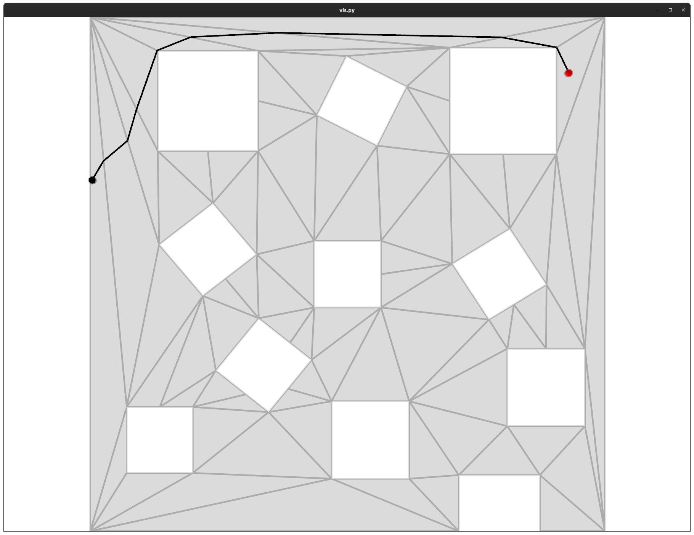
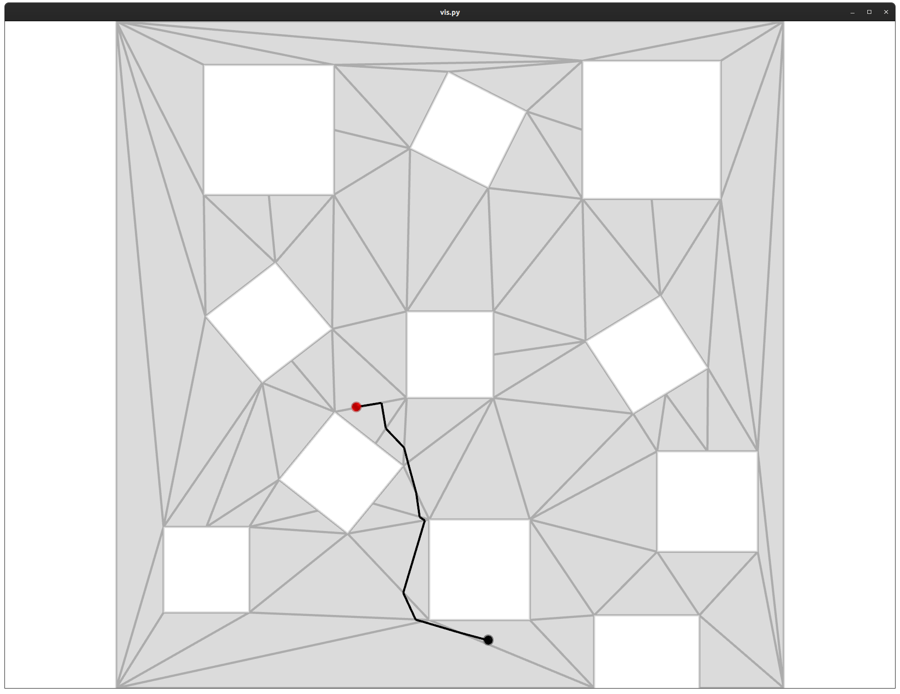
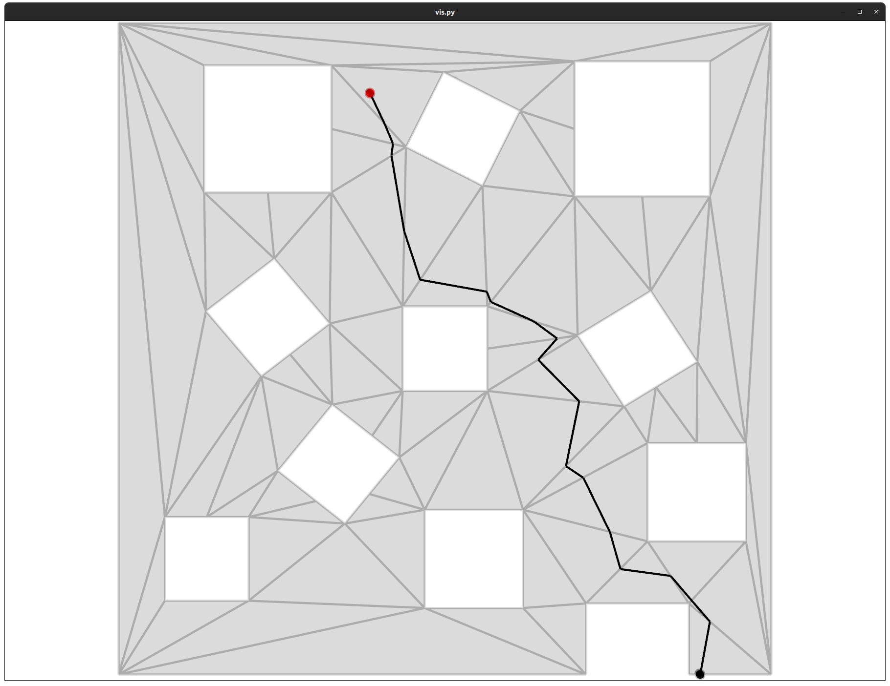
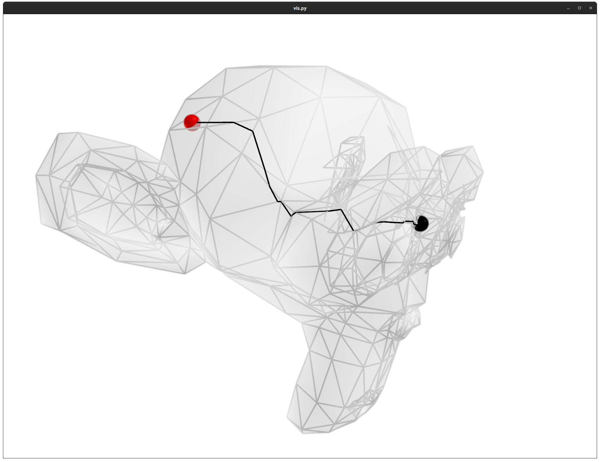
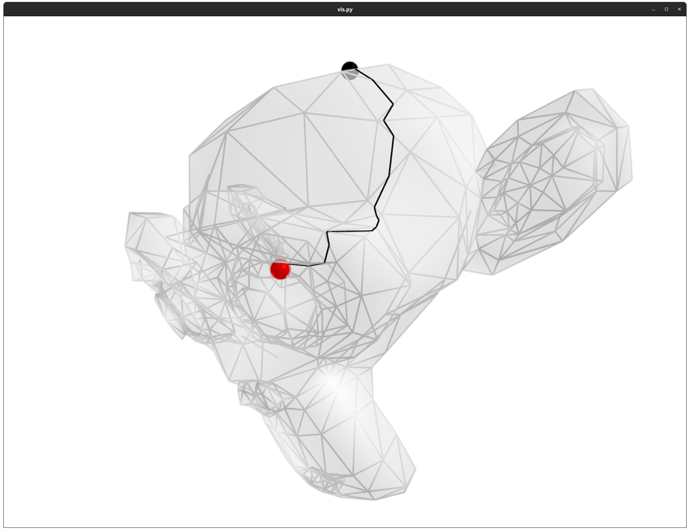
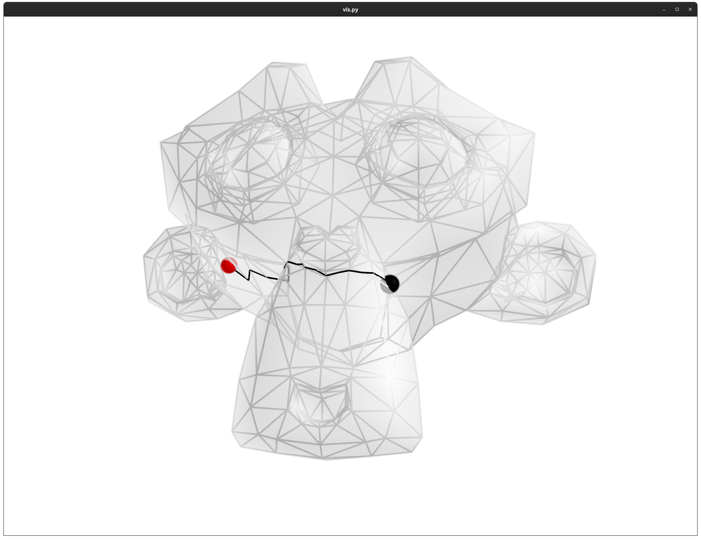

# NavTrimesh

This work is to perform path finding in a navigation mesh, based on the A* algorithm. The navigation mesh should be pre-calculated via e.g. Blender, Unity3D, Unreal, and so on. The **ONLY** requirement of the navigation mesh is, that it should be a **triangle mesh**.

When using this code, please cite our work. Thanks!
```
@inproceedings{zhang2021we,
  title={We are More than Our Joints: Predicting how 3D Bodies Move},
  author={Zhang, Yan and Black, Michael J and Tang, Siyu},
  booktitle={Proceedings of the IEEE/CVF Conference on Computer Vision and Pattern Recognition},
  pages={3372--3382},
  year={2021}
}
```


## features
Overall, this path finding module requires a triangle nagivation mesh, a starting location, and a target location. If any of the two given locations are not on the mesh, an error is raised. The navigation has two modes, depending on how to locate the avatar within each triangle.

- The `random` mode: In each triangle, we randomly select a point as the sub-target. Therefore, the produced path is not deterministic. This can increase the diversity. On the other hand, the path may not be short.
- The `on_edge` mode: The sub-target points are located on triangle edges, and are determined by projecting the target/current location to that edge. The produced path is shorter than `random`, but is still not global-optimal.


## examples
One can start with `python vis.py`. Both the maze example and the monkey example spend less than 2 seconds, from clicking enter to seeing the visualization.

In the visualization, the red and black dots denote the starting and the target locations, respectively.




<br>



<br>


:warning: Note that in some cases of `monkey.obj`, the search can fail. This is mainly because the search algorithm reaches some isolated triangles without any unsearched neighbours in the very beginning. In this case, the algorithm produces an empty list of the face neighbourhood. This failure might indicate that the generated mesh is not perfect. But bugs of this code are welcome to report.


